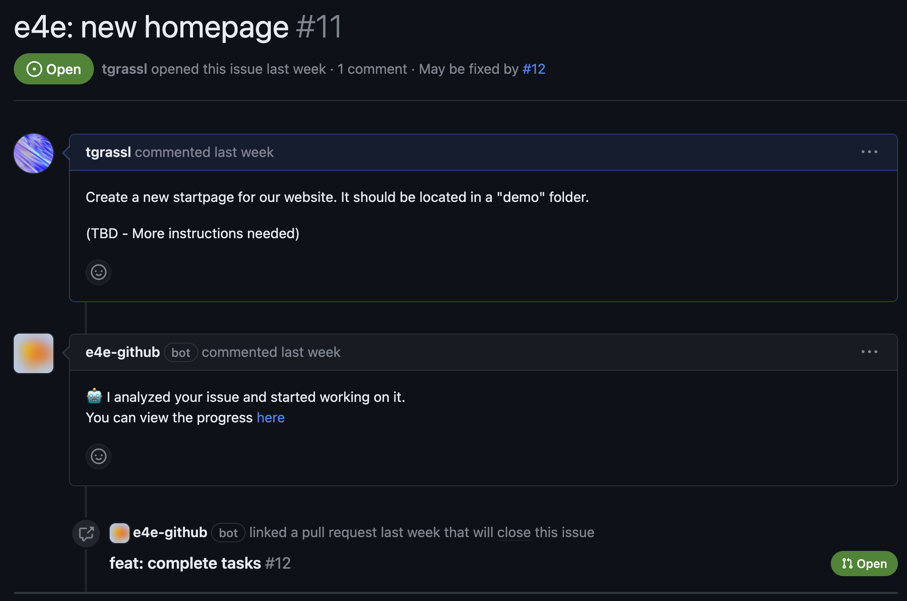
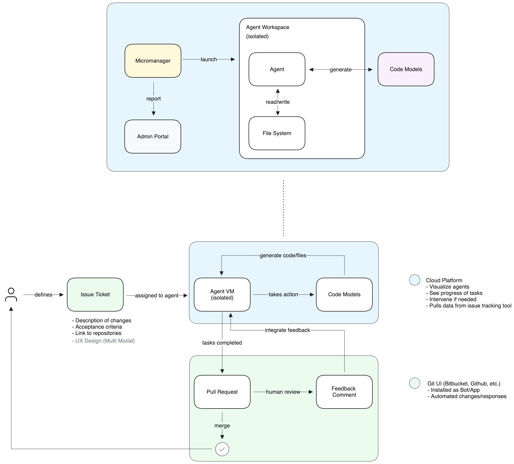

# engineers-4-everyone
✅ From Issue to Code in minutes!

🔒 Isolated agents for each project

👷 Integrates into existing workflows

## Vision
As we see the rise of projects like [smol-developer](https://github.com/smol-ai/developer) or [gpt-engineer](https://github.com/AntonOsika/gpt-engineer) and increasing context windows, I can envision a future where code agents work alongside humans in projects of any size. My idea focuses on tight integration with existing issue tracking/git workflows to allow agents to help fix bugs, implement new features, or even create new projects from scratch.

### Workflow
A product owner/engineer still defines the requirements in an issue/story, but assigns it to the ai agent. The agent will then analyze the issue and post comments to clarify if it is unsure about something.

It then starts working on those requirements in an isolated workspace, and when finished, opens a pull request for review.

Now the human engineers can review the changes and suggest changes/give feedback to the agent. The agent uses this feedback to modify the code and push new commits.

If the changes are approved, the pull request is merged and the loop continues.

Throughout the process, human engineers or product owners can monitor the agent in a separate UI. It displays information about the current task, thoughts, and more. This can help to give more visibility into the agent, rather than having it act like a black box.

### GitHub Example

### Architecture

### Ideas
- Agents can be deployed on-premise or in the cloud
- Use Firecracker VMs as isolated workspace
- Fine-tune commercially available base models (Falcon 40B, etc.)
- Use multiple models for specific tasks
- Consider UX designs in code generation (Multi-modal)
